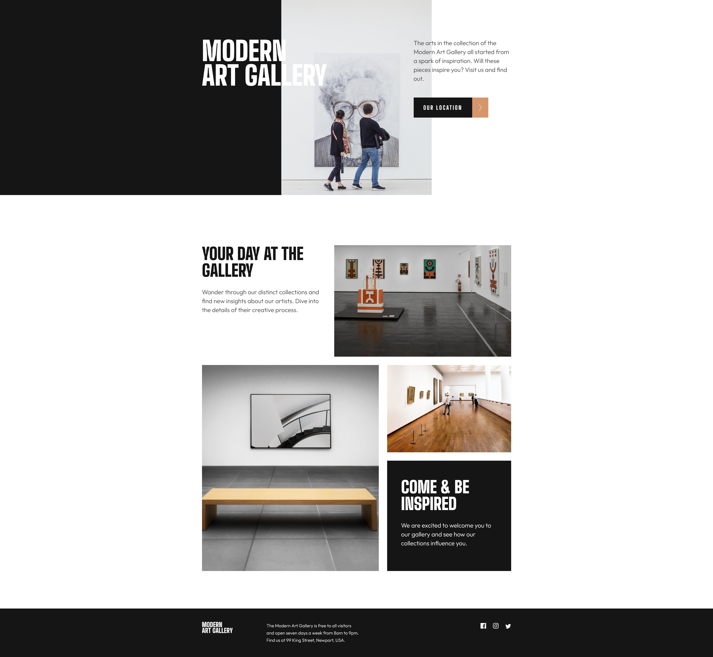
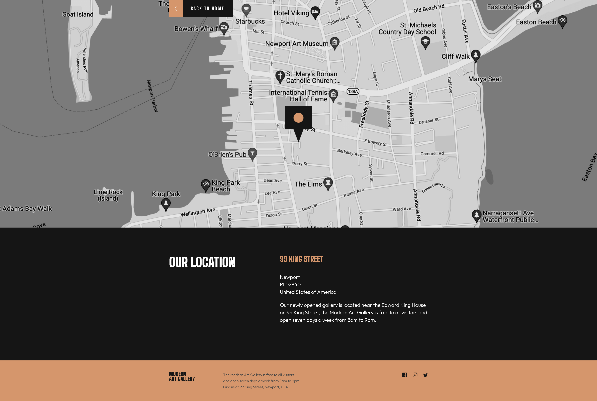

# Frontend Mentor - Art gallery website solution

This is a solution to the [Art gallery website challenge on Frontend Mentor](https://www.frontendmentor.io/challenges/art-gallery-website-yVdrZlxyA). Frontend Mentor challenges help you improve your coding skills by building realistic projects. 

## Table of contents

- [Overview](#overview)
  - [The challenge](#the-challenge)
  - [Screenshots](#screenshots)
  - [Links](#links)
- [My process](#my-process)
  - [Built with](#built-with)
  - [What I learned](#what-i-learned)
  - [Useful resources](#useful-resources)
- [Author](#author)

## Overview

### The challenge

Users should be able to:

- View the optimal layout for each page depending on their device's screen size
- See hover states for all interactive elements throughout the site

### Screenshots





### Links

- Solution URL: [Add solution URL here](https://your-solution-url.com)
- Live Site URL: [Add live site URL here](https://your-live-site-url.com)

## My process

### Built with

- Semantic HTML5 markup
- SASS / SCSS
- BEM naming conventions
- Flexbox
- CSS Grid
- Mobile-first workflow
- Responsive design

### What I learned

- Making images responsive within a CSS grid using the background-image and background-size properties.

```css
.example-of-this {
    &__image-1 {
        background-image: url(/images/mobile/image-grid-1@2x.jpg);
        background-size: cover;
        background-repeat: no-repeat;
        height: 20rem; // 320px
        width: auto;
        background-position-y: bottom;
        margin-bottom: 1.5625rem; // 25px

        @include breakpoint-up(medium){
            grid-column: 6/13;
            grid-row: 1/2;
            background-image: url(/images/tablet/image-grid-1@2x.jpg);
            height: 100%;
            margin-bottom: 0.6875rem; // 11px
        }
    }
}
```

- Creating a div with a two-tone background colour, with a hard split rather than a gradual gradient

```css
.two-tone-div{
          background: linear-gradient(
            to left, 
            #ffffff 0%, 
            #ffffff 50%, 
            $almostBlack 50%, 
            $almostBlack 100%
          );
}
```

### Useful resources

- [CSS-Tricks: A Complete Guide to Grid](https://css-tricks.com/snippets/css/complete-guide-grid/) - The ultimate CSS Grid Guide
- [Coder Coder: SASS, BEM & Responsive Design(4 hr beginners course)](https://youtu.be/jfMHA8SqUL4) - A brilliant primer to SASS, including setting up VS Code, SASS file and document structure, SCSS syntax and much more.

## Author

- Website - [Josh Brown](https://www.joshbrownmedia.com)
- Frontend Mentor - [@jbmedia](https://www.frontendmentor.io/profile/jbmedia)
